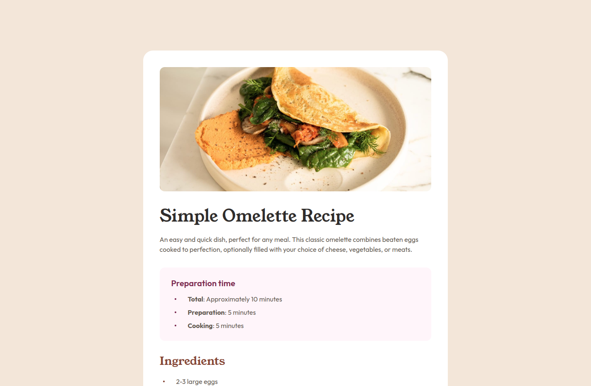

# Frontend Mentor - Recipe page solution

This is a solution to the [Recipe page challenge on Frontend Mentor](https://www.frontendmentor.io/challenges/recipe-page-KiTsR8QQKm).
Frontend Mentor challenges help you improve your coding skills by building realistic projects.

## Table of contents

- [Overview](#overview)
  - [Screenshot](#screenshot)
  - [Links](#links)
  - [Links](#links)
- [Built with](#built_with)
- [Acknowledgments](#acknowledgments)

## Overview

### Screenshot

### Links

**-Solution URL: [Add solution URL here](https://your-solution-url.com)**

**-Live Site URL: [Add live site URL here](https://your-live-site-url.com)**

### Built with

- Semantic HTML5 markup
- Tailwind CSS
- Mobile-first
- [Parcel](https://parceljs.org/) - JS Bundler

## Author

- Frontend Mentor - [@GabrielJesusS](https://www.frontendmentor.io/profile/GabrielJesusS)
